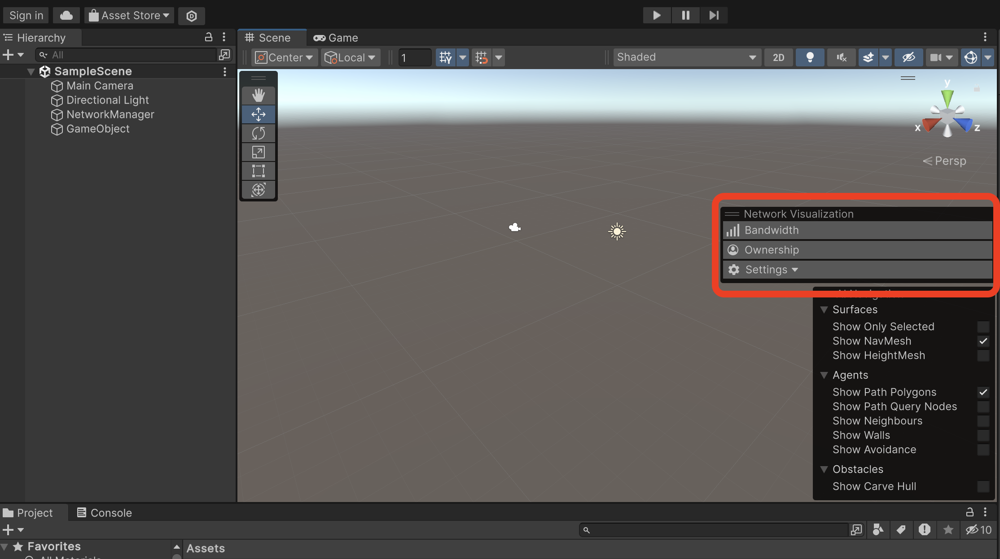

The Network Scene Visualization (NetSceneVis) is a powerful, user-friendly tool included in the Multiplayer Tools package to help you visualize and debug network communication on a per-object basis in the scene view of your project with visualizations such as mesh shading and text overlay.

The NetSceneVis tool listens to network messages about the game state to visually display bandwidth and ownership on a per-object basis in the Unity Editor. The visualizations are updated in real-time as the network messages are sent and received, showing the game state synchronization across the network.

This tool can help optimize your network code to ensure that your game runs smoothly for all players.

<!-- For full release ## Requirements
- Unity 2023.2.0a11 or higher
- Up-to-date Multiplayer Tools package, see [Install the Multiplayer Tools Package](./install-tools.md) -->

## Requirements
- Unity 2023.2.0a11 or higher
- Up-to-date Multiplayer Tools package from the `develop` branch.

### Installing Network Scene Visualization from `develop`

You can install the `develop` branch of the Multiplayer Tools package as a local git clone.

### Installing from a local git clone
Instructions for installing a package from a local folder can be found here. A local clone of the Multiplayer Tools package can be created using the following git command:

git clone https://github.com/Unity-Technologies/com.unity.multiplayer.tools.git

1. Open your Unity Hub and select the Project your are presently working on.
2. In the editor's menu bar, navigate to **Window** > **Package Manager**.
3. Click the plus sign  in the Package Manager status bar and select **Add package from disk...**.
4. Navigate to the folder root of your local package.
5. Double-click the `package.json` file in the file browser. The file browser closes, and the package now appears in the package list with the  tag.

:::note
If you have a package installed locally that matches a version in the registry, the **Update** button still appears and the list might display the same version twice as **Currently Installed** and **Recommended**.
:::

## Using Network Scene Visualization

After [installing the Multiplayer Tools package](#requirements), the Network Visualization toolbar is available in the scene view of the Unity Editor. This toolbar includes the options to visualize networking information per-object of your game.

Hovering over each option under **Bandwidth**, **Ownership**, and **Settings** reveals detailed tooltips for each option.

### Bandwidth

Adjusting the Bandwidth options displays the bandwidth usage of each object.

| Option | Description |
|---|---|
| *Type* | Filter the bandwidth by type: network variables (**NetVars**), **RPCs**, or **All**. **All** includes spawn, despawn, ownership change, network variables, and RPCs. |
| *Direction* | Filter bandwith by direction: **Sent**, **Received**, or **Sent and Received**. |
| *Smoothing* | Smooth the bandwidth data over time. Higher values improve readability by filtering out sudden data changes. This option is disabled when paused. |
| *Text Overlay* | Visualize the per-object bandwith with text labels. |
| *Shading* > *Auto Scale* | Automatically scales the mesh shading visualization to the current maximum per-object bandwidth of any object in the scene. The minimum bandwidth will always be 0. |
| *Shading* > *Min/Max Bandwidth Bar* | When **Auto Scale** is unchecked, you can manually choose the min and max bandwidth values. The color bar can be changed between 4 options. The color bar can be changed when **Auto Scale** is checked or unchecked. |

### Ownership

The Ownership options displays the ownership of each object by the server/host or the client.

| Option | Description |
|---|---|
| *Text Overlay* | Visualize the per-object ownership with text labels. |
| *Shading* | Visualize the per-object ownership with a colored overlay. |

### Settings

You can toggle the **Outline** option to display a black outline around networked objects to improve visibility in the scene and distinguish between overlapping networked objects.

The **Saturation (%)** controls the saturation of non-networked objects so networked objects can stand out more. The scale goes from 0 as grayscale to 100 for full color.